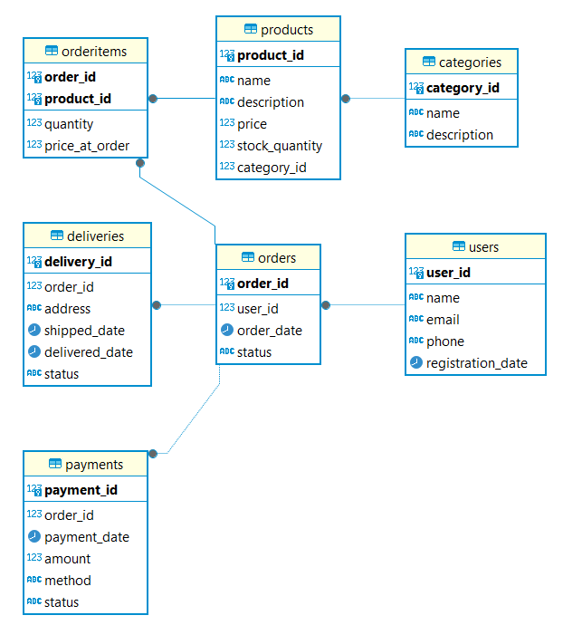

# 0. Описание предметной области

В рамках данного проекта рассматривается **онлайн-магазин** для реализации товаров через Интернет. Система онлайн-магазина обеспечивает взаимодействие между покупателями и магазином.

Основные участники бизнес-процесса - **пользователи** (далее - **покупатели**), которые регистрируются в системе, выбирают товары из каталога, добавляют в заказ и оформляют покупку. После оформления заказа нужно произвести оплату и доставку по адресу.

Для корректного функционирования системы необходимо фиксировать информацию о пользователях, товарах, категориях товаров, заказах, оплатах и доставках. 

# 1. Сущности предметной области

1. **Пользователь**

2. **Товар**

3. **Категория товара**

4. **Заказ** 

5. **Оплата**

6. **Доставка** 

7. **Позиция заказа** - реализация связи "м-м" между "Заказ" и "Товар"

## 2.Нормализация

### 1НФ

Вся информация хранится в 1 таблице. Есть ряд проблем: данные товара повторяют ся в разных заказах, нельзя добавить пользователя или товар без заказа.

### 2НФ

Устранили частичные зависимости, разделив на 3 логические сущности: "Заказы", "Товары", "Позиция заказа".

### 3НФ

Устранили транзитивные завимости: "Пользователи", "Категория товара", "Товары",
"Заказы", "Позиция заказа", "Оплаты", "Доставка"

## 3. Физическая модель

Результаты - в файлах .sql

## 4. ERD

Диаграмма "сущность-связь":

